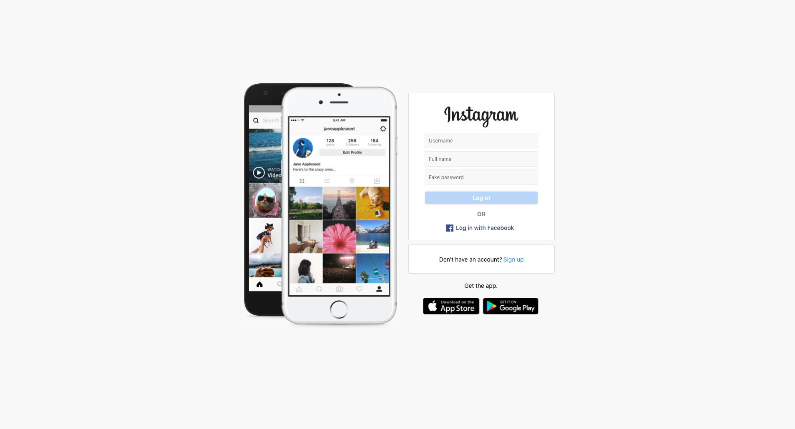
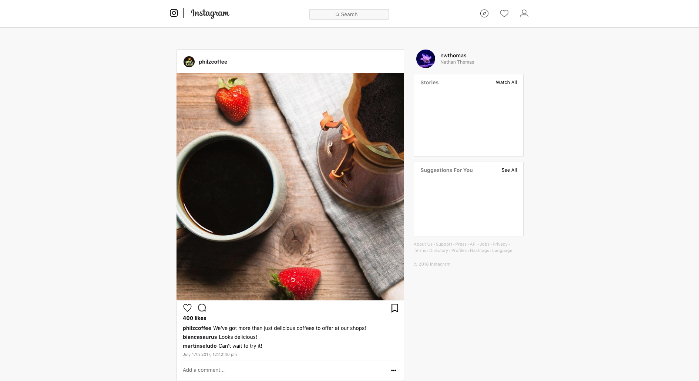

<h1 align="center"></h1>

# Instagram Clone

As one of the most popular social media sites on the planet, Instagram has a great cocktail of photo posts, text, and stories that make users want to keep coming back to use it.

Due to this, I thought that this Instagram clone would be a great way to showcase React and Sassy CSS (SCSS) as well as to build an interesting portfolio piece. Although you are not required to login with a specific username, you will find that the login functionality is otherwise present and fun to use. I hope you enjoy my work!

## Screenshots

 

## Getting Started

- Fork or directly clone this repository to your local machine
- Use the `yarn` command to install dependencies including:
  - `React`
  - `Node SASS`
- Once the dependencies are finished installing, use the `yarn start` command inside the root directory to open the portfolio app in your local browser of choice

## Built With

- [React](https://reactjs.org/)
- [Sassy CSS](https://sass-lang.com/)

## Project Management

- Check out the [Trello Board](https://trello.com/b/6NxmjO5h/instagram-clone-application) for this project to see what was completed along the way

## Author

- [Nathan Thomas](https://github.com/nwthomas)

## Acknowledgements

- Thanks to [Cecil John Tantay](https://github.com/cjbt) for coding the same application right alongside me. You helped me stay sane while working on this project.
